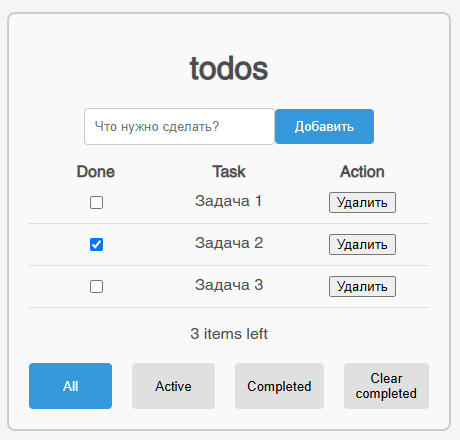

# 📝 React TypeScript Todo App

Простое приложение "Список задач" (Todo App), разработанное на **React** с использованием **TypeScript**.  
Включает возможность добавления, удаления и управления статусом задач, а также покрытие тестами.

## 🚀 Установка и запуск проекта

### 1️⃣ Клонирование репозитория
```bash
git clone https://github.com/vladislav032/TestTaskMindbox.git
cd TestTaskMindbox
```
### 2️⃣ Установка зависимостей
```bash
npm install
```
### 3️⃣ Запуск приложения
```bash
npm run start
```

### Скриншот работающего приложения


## 🛠 Настройка окружения для тестов

Перед запуском тестов убедитесь, что у вас установлены:

```bash
npm install --save-dev @testing-library/react @testing-library/jest-dom @testing-library/user-event jest @types/jest
```
## 🧪 Тестирование компонентов
### TodoActive (Активные задачи)
- **Фильтрация задач**  
  ✓ Отображает только задачи с `completed: false`  
  ✓ Скрывает завершенные задачи  
  ✓ Корректно подсчитывает количество активных задач (2 в тестовых данных)

- **Обработка действий**  
  ✓ Вызывает `onToggle` с правильным ID при клике на чекбокс  
  ✓ Вызывает `onDelete` с правильным ID при удалении  
  ✓ Чекбоксы остаются неотмеченными для активных задач  

- **Граничные случаи**  
  ✓ Не рендерит элементы при отсутствии активных задач  
  ✓ Корректно обновляется при добавлении новых активных задач  

### TodoAll (Все задачи)
- **Отображение списка**  
  ✓ Показывает все задачи независимо от статуса  
  ✓ Отображает правильное количество элементов (3 в тестовых данных)  

- **Взаимодействие**  
  ✓ Корректно обрабатывает изменение статуса (`onToggle`)  
  ✓ Правильно удаляет задачи (`onDelete`)  

- **Визуальные состояния**  
  ✓ Чекбоксы отображают текущий статус задачи  
  ✓ Не рендерит элементы при пустом списке  

### TodoCompleted (Завершенные задачи)
- **Фильтрация**  
  ✓ Показывает только задачи с `completed: true`  
  ✓ Игнорирует активные задачи  

- **Обработка событий**  
  ✓ Передает правильные ID при изменении статуса/удалении  

- **Особые состояния**  
  ✓ Пустой список при отсутствии завершенных задач  
  ✓ Динамическое обновление при добавлении новых задач  

### TodoInput (Форма ввода)
- **Структура**  
  ✓ Содержит поле ввода и кнопку добавления  
  ✓ Имеет корректный placeholder  

- **Логика работы**  
  ✓ Обновляет значение при вводе текста  
  ✓ Блокирует отправку пустых задач  
  ✓ Очищает поле после успешного добавления  

### TodoItem (Элемент задачи)
- **Отображение**  
  ✓ Показывает текст задачи  
  ✓ Правильно отображает статус (чекбокс)  

- **Обработка событий**  
  ✓ Корректно передает ID при изменении статуса  
  ✓ Правильно удаляет элемент  

- **Стилизация**  
  ✓ Применяет класс `completed` для завершенных задач  

### TodoList (Список задач)
- **Рендеринг**  
  ✓ Отображает все переданные задачи  
  ✓ Показывает правильное количество элементов  

- **Функциональность**  
  ✓ Обрабатывает изменение статуса для каждого элемента  
  ✓ Корректно удаляет задачи из списка  

### TodoTable (первый тестовый файл)
- **Рендеринг компонента**  
  ✓ Корректно отображает все задачи при фильтре 'all'  
  ✓ Отображает обе задачи (активную и завершенную) в общем списке  

- **Обработка событий**  
  ✓ Корректно передает ID задачи при изменении статуса (onToggle)  
  ✓ Правильно вызывает обработчик удаления с нужным ID (onDelete)  

- **Интеграция с дочерними компонентами**  
  ✓ Взаимодействует с TodoAll для отображения полного списка задач  
  ✓ Передает пропсы onToggle и onDelete в дочерние компоненты  

### TodoTable (второй тестовый файл)
- **Выбор правильного дочернего компонента**  
  ✓ Отображает TodoAll при фильтре "all"  
  ✓ Показывает только TodoActive при фильтре "active"  
  ✓ Рендерит исключительно TodoCompleted при фильтре "completed"  

- **Структура таблицы**  
  ✓ Создает таблицу с корректным CSS-классом (todo-table)  
  ✓ Содержит правильную HTML-структуру (thead и tbody)  
  ✓ Имеет верное количество строк и заголовков в thead  

- **Изоляция компонентов**  
  ✓ Не отображает неактивные фильтры (только выбранный)  
  ✓ Корректно мокает дочерние компоненты для тестирования  

- **Граничные случаи**  
  ✓ Очищает моки перед каждым тестом (beforeEach)  
  ✓ Не ломается при передаче пустого массива задач  

## Запуск тестов
```bash
npm test
```